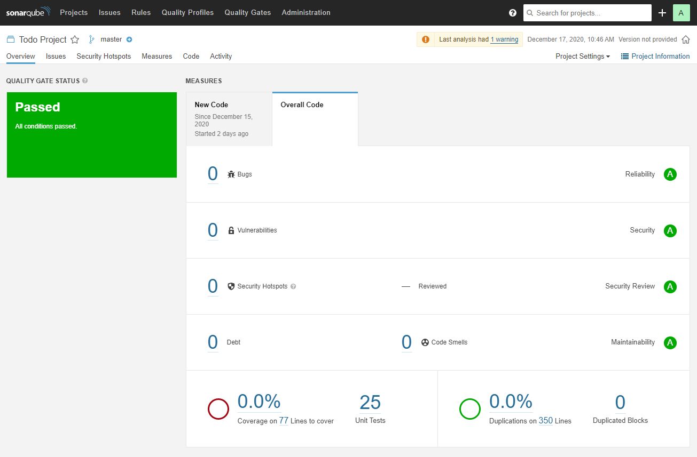

# To-Do Project<a name="top"></a>
[Jira Board](https://team-1603895273256.atlassian.net/jira/software/projects/TDP/boards/6/roadmap?shared=&atlOrigin=eyJpIjoiODc4MzkwNjg4MmFmNGMzZmE1ZTNhMjQ1ZWUwNWRkNjciLCJwIjoiaiJ9)

A small To-Do Full Stack application, the back-end was created in Java using Spring. The front-end is basic HTML, CSS,
JavaScript - with a little Bootstrap 4 and JQuery.

## Contents
* #### [Getting Started](#Getting_Started)
    * [Prerequisites](#Prerequisites)
* ##### [Cloning](#Cloning)
    * [Git Clone](#Git_Clone)
    * [Spring Tool Suite](#Spring)
        * [Open Project](#S_Open)
        * [Run the Project](#S_Run)
* ##### [Testing](#tests)
    * [Unit Tests](#Unit_Tests)
    * [Integration Tests](#Integration_Tests)
    * [Static Analysis](#Static_Analysis)
* ##### [Deployment](#deployment)
* ##### [Documentation](#documentation)
* ##### [Appendix](#appendix)
    * [Built With](#Built_With)
    * [Versioning](#Versioning)
    * [Authors](#Authors)
    * [License](#License)
    * [Acknowledgments](#Acknowledgments)

# Getting Started<a name="Getting_Started"></a>

These instructions will get you a copy of the project up and running on your local machine for development and testing purposes.

See deployment for notes on how to run the compiled version on a live system.

### Prerequisites<a name="Prerequisites"></a>

What things you need to install the software and how to install them

```
Maven (The project was built using v3.6.3)
JDK (V11+)
Spring Tool Suite
```
[Go to the Top](#top)

# Cloning<a name="Cloning"></a>

A step by step of how to set up a development environment.

#### Clone the Repository<a name="Git_Clone"></a>
In your desired directory run:

```
 git clone https://github.com/JasonFyfe/to-do-project.git
```

[Go to the Top](#top)

## Spring Tool Suite<a name="Spring"></a>
Instructions for opening the project with Eclipse.

### Open Project<a name="S_Open"></a>
```
File > Open Projects from File System
```

```
On the Import Dialog: Select 'Directory...'
```

```
Using the File Explorer, locate where you cloned the project and select the folder.
```

[Go to the Top](#top)

### Run the Project<a name="S_Run"></a>
```
Right-Click the Project > Run As > Spring Boot App
```
```
Navigate to http://localhost:8081/ in your browser.
```

[Go to the Top](#top)

## Testing<a name="tests"></a>

All the Unit & Integration testing was performed in Spring. SonarQube was used for Static Analysis.

### Unit Tests<a name="Unit_Tests"></a>

These were created to ensure the functionality of our code was performing as we expected on a singular method or function.

This is an example of a Unit Test extracted from the project.
```java
@Test
void createTest() throws Exception
{
    // When this happens, return specific data
    when(this.service.create(TEST_NOTE_1)).thenReturn(this.mapToDTO(TEST_NOTE_1));
    // Ensure what was returned
    assertThat(new ResponseEntity<NoteDTO>(this.mapToDTO(TEST_NOTE_1), HttpStatus.CREATED))
    // Is the same as the original data
    .isEqualTo(this.controller.create(TEST_NOTE_1));
    // Make sure the method ran at least one time
    verify(this.service, atLeastOnce()).create(TEST_NOTE_1);
}
```
[Go to the Top](#top)

### Integration Tests<a name="Integration_Tests"></a>
Integration Tests are so we can test larger portions of the codebase working together.

Typically these test run sections or groups of code that depends upon each other.

Testing the same method from above in the Unit Test, but now we are also testing the code it relies upon to operate correctly.
```java
@Test
void createTest() throws Exception {
    // Creating some test data
    NoteDTO testDTO = mapToDTO(new Note("Movies List"));
    String testDTOAsJSON = this.jsonifier.writeValueAsString(testDTO);
    
    // Constructing a http request
    RequestBuilder request = post(URI).contentType(MediaType.APPLICATION_JSON).content(testDTOAsJSON);
    ResultMatcher checkStatus = status().isCreated();
    
    // Constructing the data we expect to return from the test
    NoteDTO testSavedDTO = mapToDTO(new Note("Movies List"));
    testSavedDTO.setId(4L);
    String testSavedDTOAsJSON = this.jsonifier.writeValueAsString(testSavedDTO);
    ResultMatcher checkBody = content().json(testSavedDTOAsJSON);
    
    // Running the test, passing in our test data and comparing it to what we expect in return
    this.mvc.perform(request).andExpect(checkStatus).andExpect(checkBody);
}
```
[Go to the Top](#top)

### Static Analysis<a name="Static_Analysis"></a>
SonarQube was used for Static Analysis of the project.

What SonarQube does is scan our source code, and checks for coding errors from a Design, Security and Vulnerability standpoint.

It generates a report that we can then act upon to correct and review any issues with the codebase.

This is an example report given by SonarQube for the project.

[Go to the Top](#top)

## Deployment<a name="deployment"></a>
All documentation for the project can be found here: [Documentation](https://github.com/JasonFyfe/to-do-project/tree/main/documentation)

## Documentation<a name="documentation"></a>

To run the compiled version of the project you will need Java installed on your machine,
then run:
```
java -jar to-do-project.war
```

[Go to the Top](#top)

## Appendix<a name="appendix"></a>

### Built With<a name="Built_With"></a>
* [Maven](https://maven.apache.org/) - Dependency Management
* [Spring Tool Suite](https://spring.io/tools) - IDE
* [Java Development Kit](https://www.oracle.com/java/technologies/javase-downloads.html) - Java
* [Bootstrap](https://getbootstrap.com/) - Front-end Framework
* [JQuery](https://jquery.com/) - JavaScript Library for DOM manipulation
* [Jira](https://www.atlassian.com/software/jira) - Scrum Board
* [SonarQube](https://www.sonarqube.org/) - Static Analysis Tool

[Go to the Top](#top)

### Versioning<a name="Versioning"></a>
Versions were not tracked in this project as we were not doing live deployment.

[Go to the Top](#top)

### Authors<a name="Authors"></a>
* **Jason Fyfe** - [GitHub](https://github.com/JasonFyfe)

[Go to the Top](#top)

### License<a name="License"></a>
This project licensed under the MIT license - see the [LICENSE.md](LICENSE.md) file for details

[Go to the Top](#top)

### Acknowledgments<a name="Acknowledgments"></a>
* **Vinesh Ghela** - [Vinesh Ghela's Github](https://github.com/vineshghela)
* Bootstrap's Documentation

[Go to the Top](#top)
